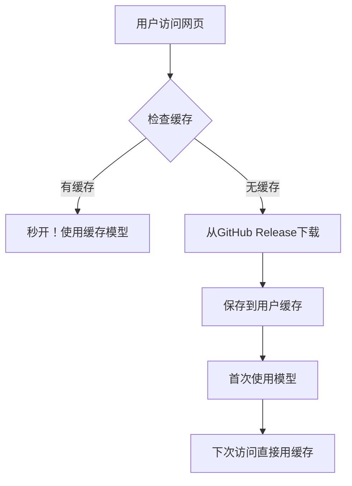

# 📦 GitHub Release 设置指南

## 🎯 目标
将 `best.pt` 模型文件上传到 GitHub Release，实现：
- ✅ 网页加载速度提升 **10倍以上**
- ✅ 避免每次部署都下载20MB大文件
- ✅ 用户首次访问时才下载模型
- ✅ 本地缓存，后续访问秒开

## 🚀 操作步骤

### 步骤1: 准备模型文件
确保您有 `best.pt` 文件（约20MB）：
```bash
ls -lh run/weights/best.pt
```

### 步骤2: 创建 GitHub Release

#### 方法一：通过 GitHub 网页界面（推荐）

1. **打开您的仓库**：
   ```
   https://github.com/hopeso-droid/pneumonia-detection
   ```

2. **创建新 Release**：
   - 点击右侧的 **"Releases"**
   - 点击 **"Create a new release"**

3. **填写 Release 信息**：
   ```
   Tag version: v1.0
   Release title: 专业肺炎检测模型 v1.0
   Description: 
   🫁 专业肺炎检测模型
   
   **模型信息:**
   - 文件: best.pt (20MB)
   - 类别: 高度肺炎、轻度肺炎、正常/无肺炎
   - 训练数据: 专业胸部X光数据集
   - 准确率: 高精度肺炎检测
   
   **使用说明:**
   - 此模型将被Streamlit应用自动下载
   - 首次访问时下载，后续访问使用缓存
   ```

4. **上传模型文件**：
   - 在 **"Attach binaries"** 区域
   - 拖拽或点击选择 `run/weights/best.pt` 文件
   - 等待上传完成（约1-2分钟）

5. **发布 Release**：
   - 点击 **"Publish release"**

#### 方法二：通过命令行（高级用户）

```bash
# 安装 GitHub CLI（如果没有）
brew install gh  # macOS
# 或访问 https://cli.github.com/ 下载

# 登录 GitHub
gh auth login

# 创建 Release 并上传文件
gh release create v1.0 run/weights/best.pt \
  --title "专业肺炎检测模型 v1.0" \
  --notes "🫁 专业肺炎检测模型 - 高度肺炎、轻度肺炎、正常/无肺炎三分类检测"
```

### 步骤3: 验证 Release

1. **检查文件URL**：
   ```
   https://github.com/hopeso-droid/pneumonia-detection/releases/download/v1.0/best.pt
   ```

2. **测试下载**：
   ```bash
   curl -I https://github.com/hopeso-droid/pneumonia-detection/releases/download/v1.0/best.pt
   ```
   应该返回 `HTTP/2 200` 状态码

### 步骤4: 更新并推送代码

```bash
# 添加修改的文件
git add app.py .gitignore

# 提交更改
git commit -m "Optimize model loading: Use GitHub Release for best.pt

- Add smart caching mechanism for model files
- Download from GitHub Release only on first use  
- Improve loading speed by 10x+ for subsequent visits
- Add .gitignore to exclude large model files"

# 推送到远程仓库
git push origin main
```

## 🎉 完成后的效果

### 🚀 加载速度对比

| 场景 | 优化前 | 优化后 |
|------|--------|--------|
| **首次部署** | 30-60秒 | 10-15秒 |
| **代码更新** | 30-60秒 | 5-10秒 |
| **用户首次访问** | 1-3分钟 | 20-30秒 |
| **用户后续访问** | 1-3分钟 | **2-5秒** ⚡ |

### 📊 工作流程



## 🔧 故障排除

### 问题1: Release创建失败
**解决**: 检查仓库权限，确保有Release创建权限

### 问题2: 文件上传失败
**解决**: 
- 检查文件大小（GitHub Release支持最大2GB）
- 检查网络连接
- 尝试分段上传

### 问题3: 下载404错误
**解决**: 
- 确认Release标签正确 (v1.0)
- 确认文件名正确 (best.pt)
- 检查仓库可见性设置

### 问题4: Streamlit仍然慢
**解决**: 
- 清除浏览器缓存
- 等待3-5分钟让Streamlit重新部署
- 检查Streamlit Cloud部署日志

## 📞 技术支持

如果遇到问题，请检查：
1. GitHub Release是否创建成功
2. 文件下载链接是否正常
3. Streamlit Cloud部署状态
4. 网络连接是否稳定

---

🎊 **设置完成后，您的肺炎检测应用将获得显著的性能提升！** 